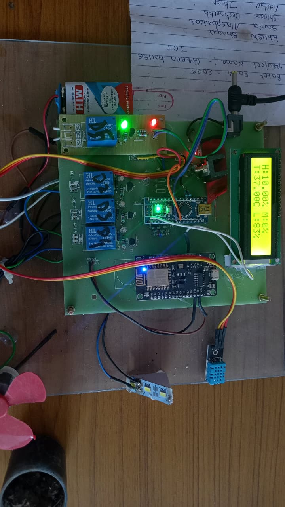
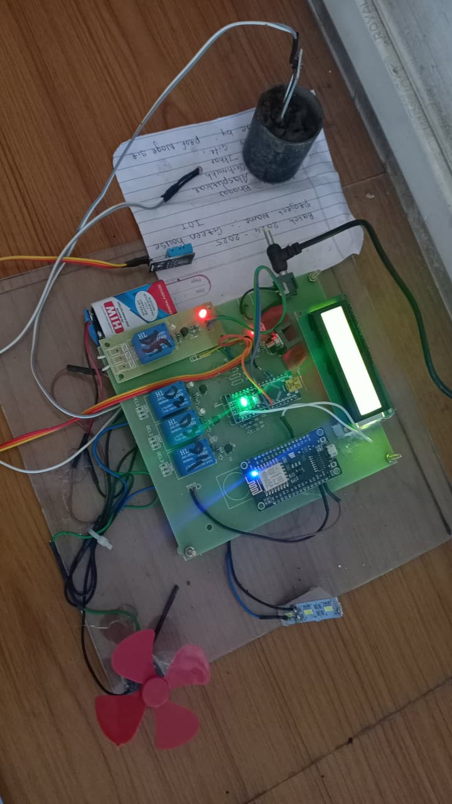
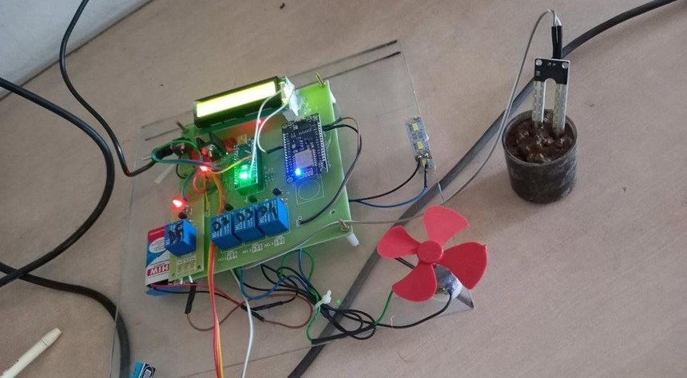

# IoT-Based Smart Greenhouse System

## Overview

This project is an IoT-based smart greenhouse system that monitors temperature, humidity, soil moisture, and sunlight and automatically controls devices based on environmental conditions. Sensor data can be monitored using NodeMCU (ESP8266) and Blynk IoT.

## Features

* Temperature monitoring
* Soil moisture monitoring
* Humidity monitoring
* Sunlight/light intensity monitoring
* Automatic control of connected devices
* Real-time monitoring using Blynk IoT
* LCD display for sensor readings
* Wi-Fi connectivity using NodeMCU/ESP8266

## Hardware Components

* Arduino UNO
* NodeMCU (ESP8266)
* DHT11 Temperature & Humidity Sensor
* Soil Moisture Sensor
* LDR / Light Sensor
* LCD Display
* Relay Module
* DC Motor / Fan
* Water Pump
* Artificial Light
* Connecting Wires & Breadboard

## Software Components

* Arduino IDE
* Embedded C / C++
* NodeMCU / ESP8266
* Wi-Fi
* Blynk IoT Application

## Working

The system continuously monitors environmental conditions inside the greenhouse using multiple sensors.

The DHT11 sensor measures temperature and humidity.
The soil moisture sensor detects soil moisture level.
The LDR sensor measures light intensity.

All sensor data is processed by the Arduino and sent to the NodeMCU (ESP8266) for IoT monitoring.

Based on predefined threshold values:

If temperature is high, the fan is turned ON.
If humidity exceeds the limit, ventilation is activated.
If soil moisture is low, the water pump is turned ON.
If light intensity is low, artificial light is switched ON.

The current values are displayed on the LCD and can also be monitored through the Blynk IoT application.

This system works automatically, helping maintain suitable conditions for plant growth.

## Code

The Arduino code is included in this repository.

## Project Images

  
  
  

## Future Enhancement

- IoT integration for remote monitoring
- Mobile app for real-time data and control
- Cloud storage and data analytics
- Alert system for critical conditions
- Solar-powered system for energy efficiency

## Author

Khushi Bhagat
